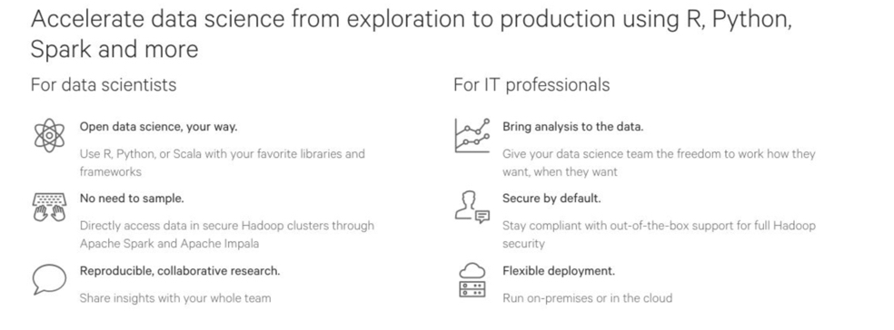

# Cloudera Data Science Workbench Lab

## Introduction

Cloudera Data Science workbench (aka CDSW) is a new product from Cloudera launched in May 2017. It is based on the acquisition of Sense.io that we made in March 2016. Cloudera has taken this product enhanced it and ensures that all workloads can be pushed down to Cloudera.

Cloudera Data Science workbench supports the R, Python, Scala programming languages. That capability could certainly be useful to Cloudera; the software could enable companies to make the most of their data scientists, who can then be more efficient with their use of company time and infrastructure.

Cloudera’s goal with Cloudera Data Science workbench is to Help more data scientists use the power of Hadoop, make it easy and secure to add new users, use cases.

Why Hadoop for Data Science well here are the reasons:

* High volume, low cost shared storage – More data more kinds of data 
* Parallel compute local to the data – more experiments, better results Scalable, fault tolerant – easy to scale out, not just scale up
* Flexible multipurpose data platform – easier path to production 
* Superior flexibility and price / performance to any other data platform

## Hands-On Lab

This one-day lab from Cloudera is a full hands-on experience on CDSW. This lab will provide you with adequate exposure on the product and help you learn some of the basic feature and functionality in the product. 

This lab is **NOT** a training. There is a formal (paid) training that is available from Cloudera University [here](https://www.cloudera.com/about/training/courses/cloudera-data-science-workbench-training.html). 

## Pre-Requisites

This lab assumes that you have atleast some basic level of understanding and experience to the following:

* Broad knowledge of Data Science
* Exposure of one/all of the following tools (R, Python, Scala)
* Basic understanding of big data technologies including Cloudera Data Platform

Please note, that **if you have limited or no experience with R, Python or Scala then you may struggle during the CDSW labs, esp. where programming ability is required**. A better option hence would be undergo a basic training on atleast Python and attemp this lab at a later date. 

## Table of Contents

We would be going through the following labs:

* [Lab 1  : CDSW Environment Access & Setup](/labs/Lab01.md)
* [Lab 2  : Hadoop Authentication](/labs/Lab02.md)
* [Lab 3  : Creating your first CDSW Project](/labs/Lab03.md)
* Lab 4  : Visualization & Sharing
* Lab 5  : 
* Lab 6  : 
* Lab 7  : SparklyR
* Lab 8  : Shiny
* Lab 9  : Scala
* Lab 10  : Project creation using local files
* Lab 11 : Scheduling Jobs
* Lab 12 : Creating Experiments
* Lab 13 : Working with Models
* Lab 14 : Sample Project - Face Recognition

## Appendix 

Additional reading material is available below:

* [Cloudera Documentation](http://www.cloudera.com/documentation.html)
* [Cloudera Data Science Workbench Documentation](https://www.cloudera.com/documentation/data-science-workbench/latest/topics/cdsw_user_guide.html)
* [CDSW User Guide](https://www.cloudera.com/documentation/data-science-workbench/latest/topics/cdsw_user_guide.html
)
* [Troubleshooting Guide](https://www.cloudera.com/documentation/data-science-workbench/latest/topics/cdsw_troubleshooting.html)

Recordings

* [Part 1 - Introduction](https://www.cloudera.com/content/dam/www/marketing/resources/webinars/introducing-cloudera-data-science-workbench-part1-recorded-webinar.png.landing.html)
* [Part 2 - A Visual Dive into Machine Learning](https://www.cloudera.com/content/dam/www/marketing/resources/webinars/part-2-visual-dive-into-machine-learning-and-deep-learning.png.landing.html
)
* [Part 3 - Data Science Models into production from beginner to end](https://www.cloudera.com/content/dam/www/marketing/resources/webinars/models-in-production-a-look-from-beginning-to-end-part3.png.landing.html)

 