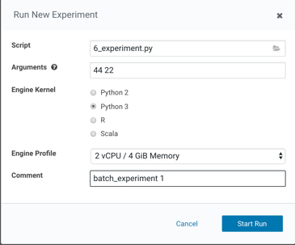
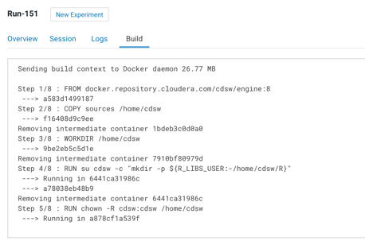

## Lab 8 : Creating Experiments

It’s often the case that data scientists need the ability to iterate and repeat similar experiments in parallel and on demand, as they rely on differences in output and scores to tune parameters until they obtain the best fit for the problem at hand. Such a training workflow requires versioning of the file system, input parameters, and output of each training run.

 This lab will give you practice running non interactive batch execution scripts called Experiments that are versioned across input parameters, project files, and output associated with a specific versioning of the project files retaining run-level artifacts and metadata.

- Open up your cdsw-demo project and open the workbench.
- Select file `6_experiment.py` and inspect the code. What do you think it does?
- From the Workbench launch a 2 vCPU/4 GiB memory Python3 session and enter the in the command prompt to run the file and verify it is working: `!python 6_experiment.py 11 1`

You now have a working python file which takes parameters that we can use to run some Experiments.

- Stop your python session. (Sessions->Stop)

- There are multiple ways in CDSW to run your Experiments:

- - Go back to the main window for your project to run an Experiment.  

  - From the Workbench you can also select **Run->Run Experiment**.  

  - Fill out the screen with your add.py file and sample numbers for the Arguments to sum.  Use the 2vCPU/4GiB RAM Python3 engine available for this example.

    

  - Hit the **Start Run** button to start the Experiment.

  - You will see the Experiment status in the main **Experiments** screen show various lifecycle status; Queued, Building, Scheduling, Running and then Success. The output will be added as a column called “Sum” from your Experiment code shown below. You could also save the output into a file as well or instead. 

- 

- 

- 

- - While it’s going through the various status, go ahead and select the Run job (job 1 in above screen shot).  If you can, look at the build status before the job completes to see the build process or run another job if you would like to see the build status in process.

    

Can you think of examples of batch experiments with different input parameters and project files
that would be be good to have multiple parallel runs and corresponding output to compare.

### End of Lab 8

------

[Back to Main](https://github.com/rajatrakesh/cdswlabs)